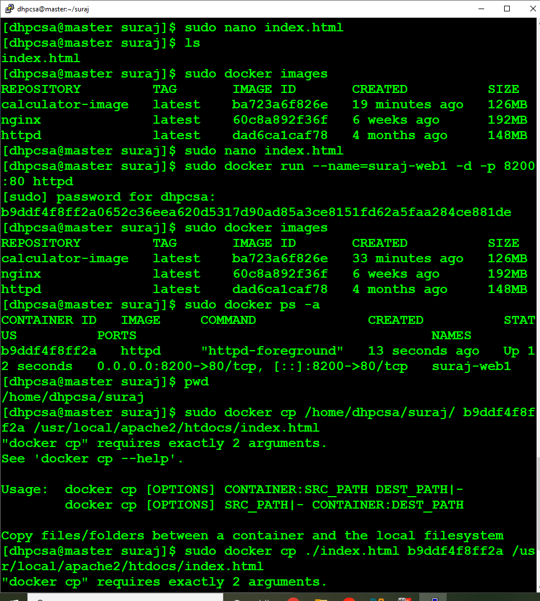
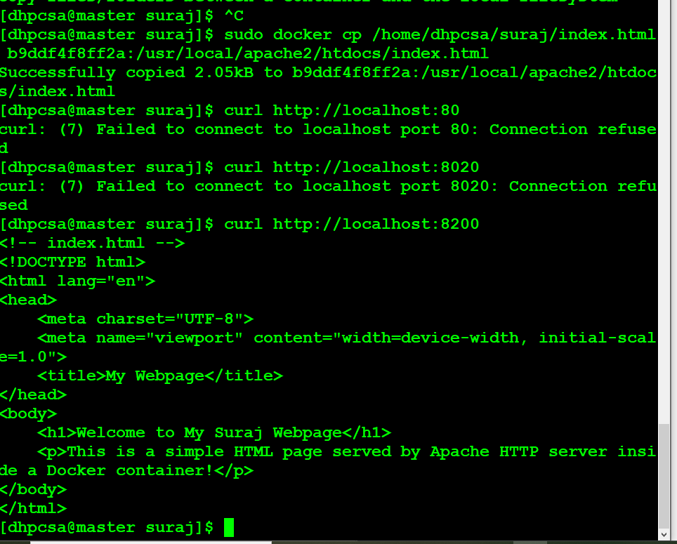
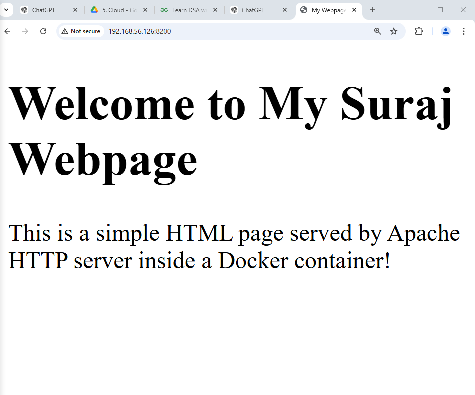

## Serving a Webpage with Apache HTTP Server in Docker

### Overview

#### *This project demonstrates deploying a simple webpage using the official Apache HTTP server Docker image (httpd). The task involves creating a directory, writing an index.html file, and running a container to serve the webpage. We'll map the container's HTTP port to a port on the host system for easy access.*

## What We Implemented

### step 1. Directory Creation
  - First, create a directory to organize the project files:

 ```yml

mkdir suraj
cd suraj

 ```


### step 2. Create the index.html File
   - Create an index.html file with basic HTML content:


```yml

<!-- index.html -->
<!DOCTYPE html>
<html lang="en">
<head>
    <meta charset="UTF-8">
    <meta name="viewport" content="width=device-width, initial-scale=1.0">
    <title>My Web Page</title>
</head>
<body>
    <h1>Welcome to My Suraj Page</h1>
    <p> This is a simple HTML page served by Apache server inside a Docker container</p>
</body>
</html>


```

### step 3. Run the Apache HTTP Server with Docker

 #### *Option 1: Using a Volume to Serve the File*
   - Run the container and map your index.html file to the container's web root:

```yml

docker run -d -p 8200:80 --name my-httpd-container -v $(pwd)/index.html:/usr/local/apache2/htdocs/index.html httpd:latest

```


- -d: Runs the container in detached mode.
- -p 8200:80: Maps port 8200 on the host to port 80 in the container.
- --name my-httpd-container: Names the container my-httpd-container.
- -v $(pwd)/index.html:/usr/local/apache2/htdocs/index.html: Mounts the local 
   index.html file to the container's web server document root.
- httpd:latest: Uses the latest version of the official Apache HTTP server image.

  #### *Option 2: Copying the File into a Running Container*
  
   - Alternatively, copy the index.html file into a running container:

### 1. Start a container from the httpd image:

```ynl

docker run -d -p 8200:80 --name my-httpd-container httpd:latest

```

### 2. Copy the index.html file into the container:

```yml

docker cp index.html my-httpd-container:/usr/local/apache2/htdocs/index.html

```


### step 4. Access the Webpage
*Once the container is running:*

  - Open a browser and navigate to http://localhost:8200.
  - You should see the content of the index.html file: "Welcome to Suraj's Page".


<br>
<br>


## Detailed Explanation:
1. Why Use the Volume Mount (-v)?

   - Changes made to the local index.html file will immediately reflect on the 
     container, making it easier for testing and development.

2. Why Use docker cp?

   - This is useful when a container is already running, and you want to copy files 
      into it without restarting.

3. Apache HTTP Server (httpd) in Docker:

   - httpd is a lightweight and efficient web server image provided officially on
     Docker Hub.
   - The web root for httpd in the container is /usr/local/apache2/htdocs.

4. Stopping and Removing the Container:
 
  - To stop the container:
```yml
docker stop my-httpd-container
```
  - To remove the container:
```yml
docker rm my-httpd-container
```


<br>
<br>

### What I Learned

1. Docker Fundamentals:

  - Running containers using the docker run command.
  - Mapping host ports to container ports for web accessibility.
  - Using volume mounts (-v) and docker cp to transfer files.

2. Serving Static Content:

  - Using the httpd image to serve HTML files.

3. Container Management:

  - Starting, stopping, and managing Docker containers.


<br>
<br>
<br>


## ------------------Screnshots--------------------
1.
<br>
<br>




2.
<br>
<br>





3.
<br>
<br>




<br>
<br>


